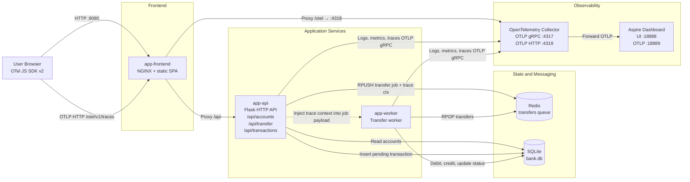

# Bank App Architecture

This diagram reflects the current banking demo in this repository: a browser-based frontend, an HTTP API, an asynchronous worker, shared SQLite storage, Redis queueing, and an OpenTelemetry pipeline into the Aspire dashboard.

## Component Summary

- `User Browser`: runs the OTel JS SDK v2 (`sdk-trace-web`, `exporter-trace-otlp-http`). Emits client spans for every API call and propagates `traceparent` headers so browser spans link to backend spans.
- `app-frontend`: serves the single-page UI on port `8080`, proxies `/api/` to `app-api`, and proxies `/otel/` to the collector's OTLP HTTP port.
- `app-api`: validates requests, reads account data from SQLite, records pending transfers, opens an explicit `redis.rpush transfers` producer span, and publishes transfer jobs to Redis with injected trace context.
- `app-worker`: dequeues jobs with `RPOP`, opens an explicit `redis.rpop transfers` consumer span, extracts the propagated trace context, and processes balance updates as a child `process_transfer` span.
- `Redis`: acts as the transfer queue between the synchronous API and the asynchronous worker.
- `SQLite`: shared persistent store for account balances and transaction history.
- `OpenTelemetry Collector`: receives OTLP gRPC (port 4317) from Python services and OTLP HTTP (port 4318) from browser, and forwards all telemetry to Aspire.
- `Aspire Dashboard`: visualizes traces, metrics, and logs for the end-to-end transfer flow.

## Request Flow

1. The browser loads the SPA from `app-frontend`. The OTel JS SDK initialises in the background.
2. The SPA calls `app-api` through the NGINX `/api/` proxy. Each call is wrapped in a client span; a `traceparent` header is injected so the API continues the same trace.
3. A transfer request creates a pending transaction in SQLite.
4. `app-api` opens a `redis.rpush transfers` producer span, injects its context into the job payload, and pushes the job to Redis.
5. `app-worker` polls Redis with `RPOP`, opens a `redis.rpop transfers` consumer span linked to the same trace ID, and runs `process_transfer` as a child span that applies balance updates in SQLite.
6. Browser spans are exported via OTLP HTTP to `/otel/v1/traces`; NGINX proxies that path to the collector's HTTP port 4318.
7. API and worker export OTLP gRPC to the collector's port 4317.
8. The collector forwards all telemetry to the Aspire dashboard.
