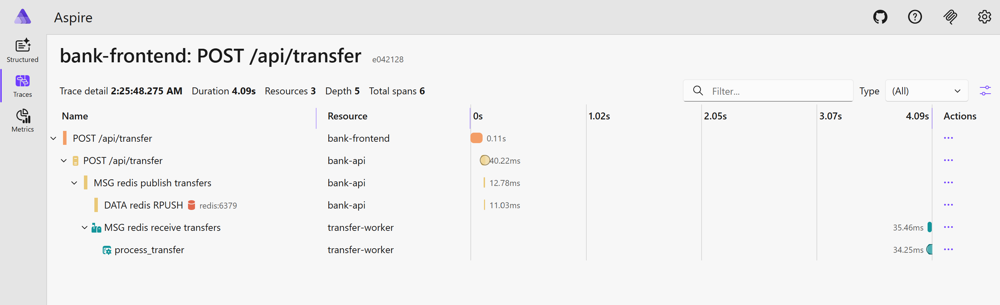

# OpenTelemetry Observability basics

Hands-on demonstration of OpenTelemetry with a simple Flask app. Covers auto-instrumentation, manual instrumentation, and forwarding telemetry (logs, metrics, traces) to a dashboard via an OpenTelemetry collector.

For the banking demo architecture and end-to-end observability details, see [BANK_APP_OBSERVABILITY.md](BANK_APP_OBSERVABILITY.md).

## Architecture

Otel Pipeline:

```
Flask App --> OpenTelemetry Collector --> Aspire Dashboard
```



## Option A — Full stack with Docker Compose

The fastest way to get everything running:

```bash
docker compose up --build
```

Then open:

- **App:** http://localhost:8082/rolldice
- **Dashboard:** http://localhost:18888

Hit the app endpoint a few times and watch traces, metrics, and logs appear in the Aspire dashboard.

---

## Option B — Step by step (manual)

Follow these steps to understand each component individually.

### Step 1 — Run the app

Install dependencies and start the Flask app:

```bash
uv sync
uv run flask --app app run --port 8082
```

Test it:

```bash
curl http://localhost:8082/rolldice
```

At this point the app runs but produces no telemetry — it just logs to stdout.

### Step 2 — Start the Aspire dashboard

The dashboard will visualize telemetry data once the collector is running.

```bash
docker run --rm -d \
  -p 18888:18888 \
  -p 18889:18889 \
  --name aspire-dashboard \
  mcr.microsoft.com/dotnet/aspire-dashboard:latest
```

Open http://localhost:18888 — it's empty for now.

### Step 3 — Start the OpenTelemetry collector

The collector receives telemetry from the app and forwards it to the dashboard.

> **Note:** `otel-collector-config.yaml` is configured for Docker Compose (`aspire:18889`). For standalone use, change the Aspire endpoint to `host.docker.internal:18889`.

```bash
docker run --rm \
  -p 4317:4317 \
  -v $(pwd)/otel-collector-config.yaml:/etc/otelcol-contrib/config.yaml \
  otel/opentelemetry-collector-contrib:latest
```

### Step 4 — Run the app with auto-instrumentation

Stop the app from Step 1, then restart it with the OpenTelemetry instrumentation wrapper:

```bash
OTEL_SERVICE_NAME=dice-service \
OTEL_EXPORTER_OTLP_PROTOCOL=grpc \
OTEL_EXPORTER_OTLP_ENDPOINT=http://localhost:4317 \
uv run opentelemetry-instrument \
  flask --app app run --host 0.0.0.0 --port 8082
```

Hit the endpoint again and check the Aspire dashboard — you should now see traces, metrics, and logs.

> **First time only:** if instrumentation packages are missing, install them with:
>
> ```bash
> uv run opentelemetry-bootstrap -a requirements | xargs uv add
> ```
>
> (Use `-a requirements`, not `-a install` — the latter invokes `pip` which fails in `uv` environments.)

### Step 5 (optional) — Switch to manual instrumentation

For finer control over what gets instrumented, edit `app.py` and uncomment lines 4 and 11:

```python
from opentelemetry.instrumentation.flask import FlaskInstrumentor
FlaskInstrumentor().instrument_app(app)
```

Then run without the `opentelemetry-instrument` wrapper:

```bash
OTEL_SERVICE_NAME=dice-service \
OTEL_EXPORTER_OTLP_PROTOCOL=grpc \
OTEL_EXPORTER_OTLP_ENDPOINT=http://localhost:4317 \
uv run flask --app app run --host 0.0.0.0 --port 8082
```

---

## Bonus — Monitor VSCode Copilot Chat with OpenTelemetry

Add to your VSCode `settings.json` to send Copilot Chat telemetry to the collector:

```json
"github.copilot.chat.otel.enabled": true,
"github.copilot.chat.otel.exporterType": "otlp-grpc",
"github.copilot.chat.otel.otlpEndpoint": "http://localhost:4317",
"github.copilot.chat.otel.captureContent": true
```

See: https://ohmytech.netlify.app/blog/2026/03/17/copilot-monitor-agent-usage-with-opentelemetry

---

## Banking Demo Architecture

Check out the [BANK_APP_ARCHI.md](BANK_APP_ARCHI.md) and [BANK_APP_OBSERVABILITY.md](BANK_APP_OBSERVABILITY.md) files for architecture diagrams, component summaries, and detailed request flow with OpenTelemetry tracing across the entire stack.



## References

- https://opentelemetry.io/docs/languages/python/getting-started
- https://opentelemetry.io/docs/languages/sdk-configuration/otlp-exporter
- https://opentelemetry.io/docs/collector/configuration/#receivers
